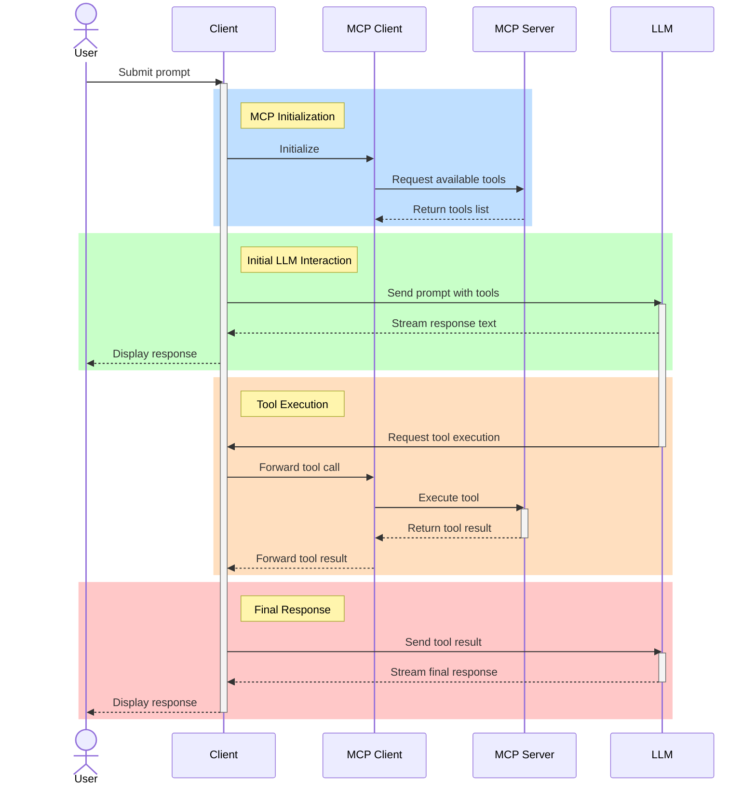

# MCP, LLMs, and You

AI Level Up 2025

---

<!-- ## Goals
After this session, attendees will be able to
1. Describe the MCP in broad terms, explain how it works, and explain what it is useful for.
2. Construct simple MCP clients and servers and connect them to an LLM
3. Use MCP to solve problems in their project domains
--- -->

## What is MCP?

- Stands for _Model Context Protocol_, released by Anthropic in November 2024.

 

- from `modelcontextprotocol.io` (Anthropic's website):

> MCP is an open protocol that standardizes how applications provide context to LLMs. Think of MCP like a USB-C port for AI applications. Just as USB-C provides a standardized way to connect your devices to various peripherals and accessories, MCP provides a standardized way to connect AI models to different data sources and tools.

---

## Why use MCP?

- Today's LLMs are excellent at understanding language and generating text, but _they can only generate text_!

 

- MCP gives LLMs a _standardized_ way to interact with the non-text world by allowing them to ask that their client do something on their behalf (eg. read a file, run a shell command, search the web, etc.).

 

- **Another analogy**: It's like you're playing chess with someone who has both hands tied behind their back. They can't make their moves themselves, but they can decide on their moves and ask you to make the move for them.

---

## HTTP vs LLM vs MCP: Flight Booking Example

### HTTP Approach (Traditional API)

- **Manual API calls**: `GET /flights`, `POST /bookings`, `PUT /bookings/{id}`
- **User needs technical knowledge**: Must know endpoints and HTTP methods
- **Example**: "Call `POST /api/bookings` with flight details to book"

### LLM Alone (Pre-trained Data Only)

- **Can provide information**: "Here are general tips about booking flights..."
- **Cannot take actions**: LLM has no access to real-time data or booking systems
- **Example**: "What flights are available?" → _"I can't check real-time flights, but typically..."_

### MCP + LLM (Intelligent Tools)

- **LLM used for natural language processing**: Understands user intent and translates to tool calls
- **Real-time data access**: LLM can use tools to get current flight info
- **Can take actions**: LLM can actually book flights through tools
- **Example**: "Book me a flight to Paris" → LLM calls `search-flights` then `book-flight`

**Key Insight**: LLMs need tools to move beyond pre-trained knowledge to real-time actions!

---

## How Does MCP Work? (1/3)

- MCP functions using a client/server model.
  - The _server_ the tools and resources that are available
  - The _client_ controls the interaction with the LLM
  - The two parties using _JSON schema_

---

## How Does MCP Work? (2/3)

This diagram roughly describes a typical MCP interaction. (This looks _much_ better in a browser!)

---

## How Does MCP Work? (3/3)

---

## What is an Agent?

### Definition

- **Agent**: A system that can take actions autonomously based on user intent.
- **Role in MCP**: Uses tools to perform tasks without requiring manual intervention.

### Agent vs Ask Mode

- **Ask Mode**: Provides planning and suggestions (e.g., "Here are steps to book a flight").
- **Agent Mode**: Executes tasks autonomously (e.g., "I booked your flight to Paris").

### LLM vs Agent

- **LLM**: Knows all things and provides general knowledge across domains. (e.g. Chat GPT, show gemini live video example with some regulation images ask it to detect potential violations)
- **Agent**: Specializes in specific roles and tasks, leveraging tools to perform actions. (e.g., booking agent, safety coordinator, Inspector for inspections specific to pre defined regulations)

### Example: Copilot Ask Mode vs Agent Mode

- **Ask Mode (LLM)**: "Here’s how you can book a flight: Search flights, select one, and book."
- **Agent Mode**: "I searched flights, selected the best option, and booked it for you."

---

### Responsibilities: LLM vs Agent in Flight Booking

#### LLM Responsibilities

- **Understand user intent**: "Book me a flight to Paris."
- **Translate intent into tool calls**: Identifies tools like `search-flights` and `book-flight`.
- **Provide conversational feedback**: "I found flights to Paris."

#### Agent Responsibilities

- **Execute tool calls**: Runs `search-flights` and `book-flight` tools.
- **Handle real-world actions**: Books the flight and confirms the reservation.
- **Autonomous decision-making**: Selects the best flight based on criteria like price and timing.

**Key Insight**: LLM focuses on understanding and planning, while the agent handles execution and decision-making!

---

### Tool vs Agent

- **Tool**: Represents business logic and performs specific tasks (e.g., "search-flights", "book-flight").
- **Agent**: A role that executes tools based on user intent, acting autonomously to complete tasks.

**Key Insight**: Tools define what can be done, while agents decide how and when to use them to achieve goals!
