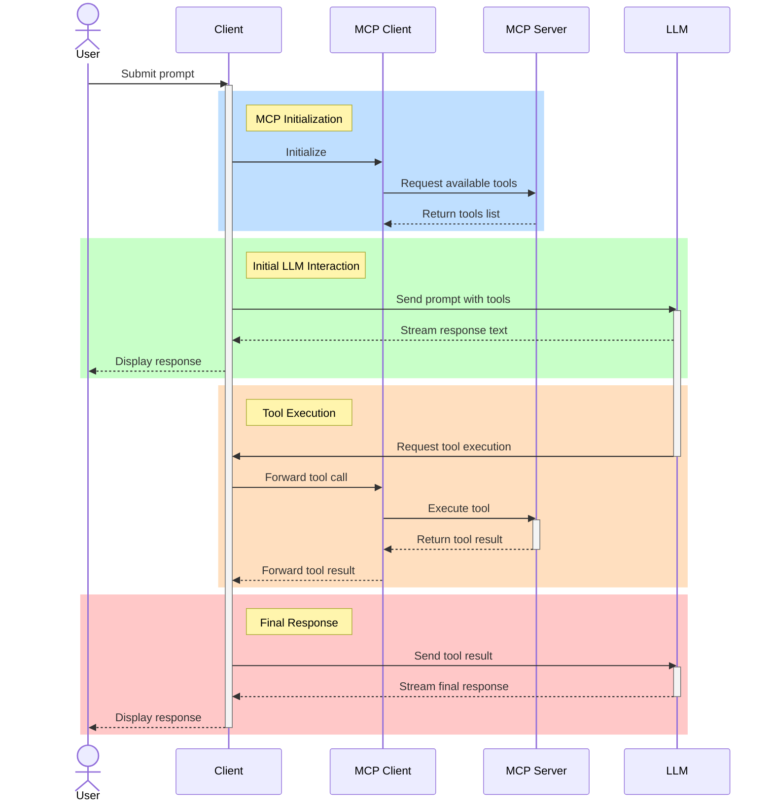

# MCP, LLMs, and You

AI Level Up 2025

<!-- ## Goals
After this session, attendees will be able to
1. Describe the MCP in broad terms, explain how it works, and explain what it is useful for.
2. Construct simple MCP clients and servers and connect them to an LLM
3. Use MCP to solve problems in their project domains
--- -->

---

## What are Tools?

- Today's LLMs are excellent at understanding language and generating text, but _they can only generate text_!
<br>

- Tools gives LLMs a way to interact with the non-text world by allowing them to ask that their client do something on their behalf (eg. read a file, search the web, run a shell command, etc.).
<br>

- **Another analogy**: It's like you're playing chess with someone who has both hands tied behind their back. They can't make their moves themselves, but they can decide on their moves and ask you to make the move for them.

---

## HTTP vs LLM vs LLM+Tools: Flight Booking Example

### HTTP Approach (Traditional API)

- Manual API calls: `GET /flights`, `POST /bookings`, `PUT /bookings/{id}`
- User must know endpoints and HTTP methods
- _Example_: Calling `POST /api/bookings` with flight details to book

### LLM Alone (Pre-trained Data)

- Can provide information: "Here are general tips about booking flights..."
- LLM has no access to real-time data or booking systems
- _Example_: "What flights are available?" → _"I can't check real-time flights, but typically..."_

### MCP + LLM (Tools!)

- LLM is used for natural language processing; it understands user intent and translates to tool calls
- LLM can use tools to get current flight info
- LLM can actually book flights through tools
- _Example_: "Book me a flight to Paris" → LLM calls a `search-flights` tool then `book-flight` tool

---

## What is an Agent?

- An *agent* is a system in which an LLM can dynamically interact with its environment and make decisions over how it accomplishes a task.
<br>

- Implementation-wise, an agent is just:

  - an LLM
  - with access to tools
  - wrapped in a loop.
<br>

- An agent is given an initial task and a set of available tools, and it iterates between calling tools, reading their output, and repeating, until it decides that it is done.

---

## Activity Time!

- Clone this repo: `https://github.com/drewzemke-rss/mcp-hackathon`
- Follow the instructions in the readme for Exercises 0 and 1.

---

## What is MCP?

- Stands for _Model Context Protocol_, released by Anthropic in November 2024.
<br>

- from `modelcontextprotocol.io` (Anthropic's website):

> MCP is an open protocol that standardizes how applications provide context to LLMs. Think of MCP like a USB-C port for AI applications. Just as USB-C provides a standardized way to connect your devices to various peripherals and accessories, MCP provides a standardized way to connect AI models to different data sources and tools.
<br>

- _tl;dr_: MCP is a _standardized_ way to connect LLMs to tools

---

## The Technical Bits: How Does MCP Work? (1/4)

- MCP functions using a client/server model.

  - The _server_ controls the tools and resources that are available
  - The _client_ controls the interaction with the LLM
  - The two parties communicate using _JSON schema_
    <br>

- Basic data flow:
  - Before a request is sent to an LLM, the MCP client requests a list of available _tools_ from the MCP server
  - The tools are forwarded to the LLM along with the original request.
  - The LLM can "decide" to invoke a tool by outputting a _tool call_, which the MCP client sees and forwards to the MCP server.
  - The MCP server executes the tool and responds with some data (as text).
  - The _tool result_ is fed into the LLM's context, and it continues generating output.

---

## The Technical Bits: How Does MCP Work? (2/4)

This diagram roughly describes a typical MCP interaction. (This looks _much_ better in a browser!)



---

## The Technical Bits: How Does MCP Work? (3/4)

If you're curious, here's what a tool call actually looks like.

```json
{
  "type": "tool-call",
  "toolCallId": "tooluse_nk2fVf__Q6CI6vcoq1QGKA",
  "toolName": "get-weather",
  "args": {
    "location": "Davis, CA"
  }
}
```

This is what's generated by the LLM!

---

## The Technical Bits: How Does MCP Work? (4/4)

The MCP client and server use a notion of _transport_ to abstract their communication.

Right now, there are two types of transport that are standard in the MCP SDKs:

- **Standard Input/Output Transport** (aka. _Stdio_)

  - The MCP client and server communicate using standard input/output streams _on a single machine_.
  - Useful for tools that interact with the local filesystem, command line integrations, etc.
    <br>

- **Streamable HTTP**
  - The MCP client and server communicate using a combination of _HTTP POST_ requests and _server-sent events (SSE_)
  - Useful when the client and server are not running in the same place.

All of the examples we'll play with today use the Stdio transport, but (almost) all of RSS's current uses of MCP use Streamable HTTP.

---

## More Exercises!

- Follow the instructions in the repo readme for Exercise 2.
