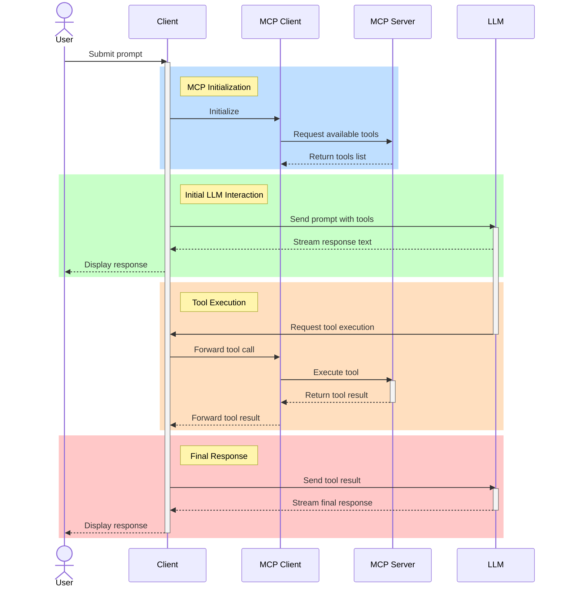

# MCP, LLMs, and You

AI Level Up 2025

---

<!-- ## Goals
After this session, attendees will be able to
1. Describe the MCP in broad terms, explain how it works, and explain what it is useful for. 
2. Construct simple MCP clients and servers and connect them to an LLM
3. Use MCP to solve problems in their project domains
--- -->

## What is MCP?

- Stands for *Model Context Protocol*, released by Anthropic in November 2024.

 

- from `modelcontextprotocol.io` (Anthropic's website):

> MCP is an open protocol that standardizes how applications provide context to LLMs. Think of MCP like a USB-C port for AI applications. Just as USB-C provides a standardized way to connect your devices to various peripherals and accessories, MCP provides a standardized way to connect AI models to different data sources and tools. 

---

## Why use MCP?

- Today's LLMs are excellent at understanding language and generating text, but *they can only generate text*!

 

- MCP gives LLMs a *standardized* way to interact with the non-text world by allowing them to ask that their client do something on their behalf (eg. read a file, run a shell command, search the web, etc.).

 

- **Another analogy**: It's like you're playing chess with someone who has both hands tied behind their back. They can't make their moves themselves, but they can decide on their moves and ask you to make the move for them.

---

## How Does MCP Work? (1/3)

- MCP functions using a client/server model.
  - The *server* the tools and resources that are available
  - The *client* controls the interaction with the LLM
  - The two parties using *JSON schema*

---

## How Does MCP Work? (2/3)

This diagram roughly describes a typical MCP interaction. (This looks *much* better in a browser!)

---

## How Does MCP Work? (3/3)

TODO: example of what a tool call actually looks like

